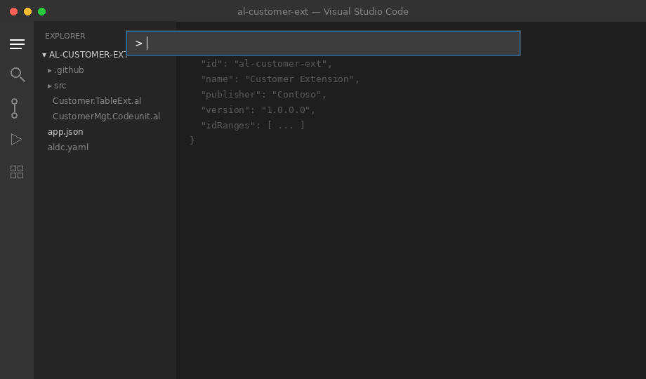
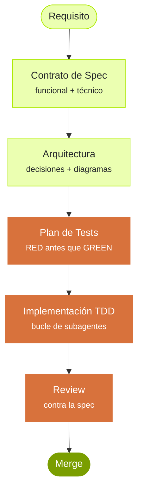

---
hide:
  - navigation
  - toc
---

# ALDC

<div class="hero">

<a class="hero-banner" href="https://javiarmesto.github.io/aldc-workshop/en/" target="_blank" rel="noopener">
  <span class="hero-banner__badge">NUEVO</span>
  <span class="hero-banner__text">El Workshop público de ALDC ya está disponible — práctico, gratuito, online</span>
  <span class="hero-banner__arrow">→</span>
</a>

<div class="hero-eyebrow">AL Development Collection · IA dirigida por specs para Business Central · <a href="../">English</a></div>

<h2 class="hero-title">Entrega extensiones de Business Central con agentes de IA que siguen tu proceso.</h2>

<p class="hero-tagline">ALDC da a Copilot y Claude Code un modelo de trabajo para entregar AL: specs, planes, tests, gates de revisión y skills reutilizables. Menos "vibe coding". Más implementación trazable.</p>

<div class="hero-actions">
  <a class="md-button md-button--primary" href="../getting-started/">Empieza por la documentación</a>
  <a class="md-button" href="../al-development/">Abre la guía de la colección</a>
  <a class="md-button" href="https://github.com/javiarmesto/ALDC-AL-Development-Collection">GitHub</a>
</div>

<div class="hero-pills">
  <span class="pill"><b>4</b> públicos + <b>2</b> bajo demanda</span>
  <span class="pill"><b>11</b> skills</span>
  <span class="pill"><b>6</b> workflows</span>
  <span class="pill pill--accent">Listo para BCQuality</span>
  <span class="pill pill--accent">Copilot + Claude Code</span>
  <span class="pill">v4.1.0 · MIT</span>
</div>

</div>

---

## Novedades en 4.1.0 { #novedades .section-title }

<div class="grid cards" markdown="1">

-   :material-flash-outline: &nbsp; **Menor coste de tokens / AIC por interacción**

    ---

    Entrypoint always-on **~31% más ligero**, globs de instrucciones estrechos por tipo de
    objeto, y contexto curado pasado a los subagentes. Las mismas capacidades — menos tokens en cada petición.

-   :material-book-search-outline: &nbsp; **Reviews y auditorías citadas con BCQuality**

    ---

    Capa de conocimiento externa opcional (configurable, por defecto el upstream
    [microsoft/BCQuality](../bcquality/)). Los agentes citan hallazgos a ficheros reales, con
    degradación elegante a checks nativos si no está. Nunca bloquea.

</div>

<div class="two-col">
<div class="two-col-text" markdown="1">

**Se instala una vez, desde la Paleta de Comandos.** Ejecuta `AL Collection: Install Toolkit to Workspace`
y ALDC copia los agentes, skills, instrucciones y configuración en tu proyecto — luego empieza con
`@AL Architecture & Design Specialist` o `@AL Development Conductor`.

También nuevos: bajo demanda **`@AL Triage`** (diagnóstico reactivo) y **`@Dredd`** (auditor
independiente) — solo lectura sobre tu código.

</div>
<div class="two-col-visual">
  
</div>
</div>

---

## Qué es ALDC { #que-es .section-title }

<div class="two-col">
<div class="two-col-text">

<p>La mayoría de herramientas de IA generan un fichero y cruzan los dedos. <strong>ALDC es diferente.</strong></p>

<p>Cada feature empieza con un <strong>contrato de spec</strong> funcional, técnico y testeable, guardado en <code>.github/plans/{req_name}/</code>. La arquitectura y el plan de tests viven al lado.</p>

<p>Un <strong>agente conductor</strong> orquesta un ciclo TDD: el subagente de Implementación escribe primero los tests, luego el código, y refactoriza. Un subagente de Review valida contra la spec. Tú apruebas cada fase.</p>

<p>Por debajo, <strong>11 skills componibles</strong> (API, eventos, rendimiento, testing y más) se cargan bajo demanda, así los agentes solo saben lo que necesitan para la tarea que tienen delante.</p>

<p>El resultado: código AL que pasa la review a la primera, con decisiones trazables desde el requisito hasta el merge.</p>

</div>
<div class="two-col-visual" markdown="1">



</div>
</div>

---

## Por qué importa { .section-title }

<div class="grid cards" markdown="1">

-   :material-file-document-check-outline: &nbsp; **Dirigido por specs, no "prompt y a rezar"**

    ---

    Se acabó "vuélveme a explicar el requisito por quinta vez".
    Cada feature tiene un contrato escrito que los agentes consultan.

-   :material-test-tube: &nbsp; **TDD obligado, no sugerido**

    ---

    El subagente de Implementación se niega a escribir código antes que los tests.
    RED → GREEN → REFACTOR está fijado en el agente.

-   :material-account-check-outline: &nbsp; **Apruebas cada fase**

    ---

    Los agentes paran en arquitectura, plan, implementación, review y deploy.
    Nada se entrega sin un humano diciendo que sí.

-   :material-shield-lock-outline: &nbsp; **Disciplina extension-only**

    ---

    Nunca toca objetos de la base. Siempre tableextensions, pageextensions,
    event subscribers. Permisos de mínimo privilegio por defecto.

-   :material-compare-horizontal: &nbsp; **Un toolkit, dos runtimes**

    ---

    Las mismas primitivas funcionan en **GitHub Copilot** y **Claude Code**.
    Usa la herramienta que ya use tu equipo.

-   :material-puzzle-outline: &nbsp; **Skills bajo demanda**

    ---

    11 skills componibles en lugar de 300kb de "sopa de prompt".
    Los agentes solo cargan lo relevante a la tarea.

</div>

---

## Reviews citadas con BCQuality { #bcquality .section-title }

<div class="two-col">
<div class="two-col-text" markdown="1">

BCQuality es una capa **opcional** que convierte a los agentes de review/auditoría en revisores
que **citan** — cada hallazgo apunta a un fichero de conocimiento real de Business Central, no a una opinión.

-   **Fuente configurable.** Por defecto el upstream canónico [microsoft/BCQuality](https://github.com/microsoft/BCQuality); apunta a tu propio fork en `aldc.yaml`.
-   **Consumo externo.** Un clon hermano vía workspace multi-root — nunca compila, nunca contamina tu app.
-   **Se engancha vía `entry.md`.** Los agentes leen la meta-skill y ejecutan lo que despache.
-   **Nunca bloquea.** Ausente por defecto → degradación nativa A–G.

[Lee la guía de BCQuality :material-arrow-right:](../bcquality/){ .md-button }

</div>
<div class="two-col-visual" markdown="1">

```text
# desde la raíz de tu proyecto AL — opt-in cuando quieras reviews citadas
bash tools/bcquality/install.sh      # o: pwsh tools/bcquality/install.ps1
#   → clona microsoft/BCQuality en ../bcquality (configurable)

# luego abre aldc.code-workspace y ejecuta:
@Dredd                               # auditoría independiente
@AL Development Conductor            # las fases de review citan BCQuality
```

</div>
</div>

---

## Inicio rápido { .section-title }

=== ":fontawesome-brands-github: GitHub Copilot (VS Code)"

    ```bash
    git clone https://github.com/javiarmesto/ALDC-AL-Development-Collection.git
    cd ALDC-AL-Development-Collection
    npm install
    npx aldc init
    ```

    Luego, en VS Code con Copilot activado:

    ```text
    @workspace use al-initialize
    ```

=== ":material-robot-outline: Claude Code"

    ```bash
    /plugin install aldc
    ```

    Luego:

    ```text
    /aldc:al-initialize
    ```

=== ":material-magnify: ¿Solo explorando?"

    ```bash
    git clone https://github.com/javiarmesto/ALDC-AL-Development-Collection.git
    cd ALDC-AL-Development-Collection
    npm install && npm run validate
    ```

---

## Recursos { #recursos .section-title }

Todo lo de ALDC está aquí. Elige tu camino.

<div class="resource-grid">

  <a class="resource-card" href="../getting-started/">
    <span class="resource-kicker">Empieza aquí</span>
    <h3>Getting Started</h3>
    <p>Instala, configura y entrega tu primera feature en menos de 10 minutos.</p>
    <span class="resource-arrow">→</span>
  </a>

  <a class="resource-card" href="../al-development/">
    <span class="resource-kicker">Guía</span>
    <h3>Guía de la colección</h3>
    <p>La guía pública de ALDC: arquitectura, primitivas, flujo, validación y adopción.</p>
    <span class="resource-arrow">→</span>
  </a>

  <a class="resource-card" href="../bcquality/">
    <span class="resource-kicker">Calidad</span>
    <h3>BCQuality</h3>
    <p>Reviews y auditorías citadas con conocimiento BC. Opcional y configurable.</p>
    <span class="resource-arrow">→</span>
  </a>

  <a class="resource-card" href="../agents/">
    <span class="resource-kicker">Roles</span>
    <h3>Agentes</h3>
    <p>Architect, Developer, Conductor, Pre-Sales — y bajo demanda Triage y Dredd.</p>
    <span class="resource-arrow">→</span>
  </a>

  <a class="resource-card" href="../prompts/">
    <span class="resource-kicker">Automatización</span>
    <h3>Workflows</h3>
    <p>6 workflows, de initialize a PR prepare. Invocables desde el chat.</p>
    <span class="resource-arrow">→</span>
  </a>

  <a class="resource-card" href="../instructions/">
    <span class="resource-kicker">Estándares</span>
    <h3>Instrucciones</h3>
    <p>9 estándares de AL siempre activos. Estilo, rendimiento, naming, errores, eventos.</p>
    <span class="resource-arrow">→</span>
  </a>

  <a class="resource-card" href="https://github.com/javiarmesto/ALDC-AL-Development-Collection">
    <span class="resource-kicker">Open source</span>
    <h3>Código fuente</h3>
    <p>Cada agente, skill y workflow. Licencia MIT. Star y fork bienvenidos.</p>
    <span class="resource-arrow">→</span>
  </a>

  <a class="resource-card" href="../CHANGELOG/">
    <span class="resource-kicker">Historial</span>
    <h3>Changelog</h3>
    <p>Releases, fixes y la evolución de la colección en el tiempo.</p>
    <span class="resource-arrow">→</span>
  </a>

</div>

---

<div class="footer-cta" markdown="1">

### ¿Listo para entregar features de BC con confianza? { .footer-cta-title }

[Instalar ALDC :material-download:](../getting-started/){ .md-button .md-button--primary }
[Abrir la guía de la colección :material-book-open-page-variant:](../al-development/){ .md-button }
[:material-star: &nbsp; Star en GitHub](https://github.com/javiarmesto/ALDC-AL-Development-Collection){ .md-button }

</div>

<div class="status-footer" markdown="1">

`✓ ALDC Core v1.1 COMPLIANT` &nbsp;·&nbsp; `v4.1.0` &nbsp;·&nbsp; `MIT` &nbsp;·&nbsp; Hecho por [Javier Armesto](https://www.linkedin.com/in/javiarmesto) &nbsp;·&nbsp; [English](../)

</div>
